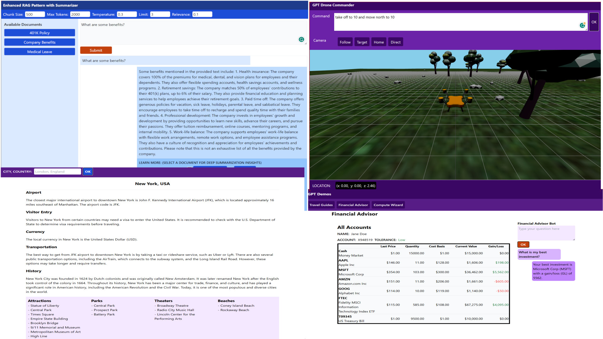

# AI-Infused Appplications with Azure OpenAI - <br/>Application Development Building Blocks


## OpenAI fundamentals

This guide is intended to provide some AI-infused application development fundamentals.

### What can be built?



The demos above include:
- RAG Pattern
- Travel Guides - Content Generation
- Financial Advisor
- Drone Driver Simulator

### What are the models and what models are there (ADA, GPT 3.5, 4)?

Azure OpenAI provides various models for different tasks, such as GPT for text generation and ADA for embeddings. These models are accessible through REST endpoints hosted on Azure, which can be invoked by sending a POST request to the corresponding URL. The models may differ in their token sizes, tokens per minute, and performance. To access these endpoints, you will need to obtain an API key or configure another security mechanism on Azure. The current models and pricing can be found here: [Azure OpenAI Service pricing](https://azure.microsoft.com/en-us/pricing/details/cognitive-services/openai-service/)

### What are tokens?

A token is defined as 3/4 of a word in English. In other languages that have accents and other characters, those characters count as tokens. If you want to see how tokens are counted, OpenAI offers a tokenizer tool at: https://platform.openai.com/tokenizer.

### What are the token limits and why are they important?

Different models of natural language generation, such as GPT 3.5, 4, and ADA, have varying token count limitations. To optimize the number of requests an account can handle, it is important to understand these limits. The token limitations depend on three factors: context size, throttling, and cost. Context size refers to the maximum number of tokens a model can process. Some models can handle 4K, 8K, 16K, 32K, or 128K tokens. Throttling happens when the limits are exceeded. In Azure, there are two limits: tokens per minute and requests per minute. If an account surpasses either of these limits, Azure will throttle the response and return an HTTP Status code 429 or Too Many Requests. Different models also have different costs associated with them. The current models and pricing can be found here: [Azure OpenAI Service pricing](https://azure.microsoft.com/en-us/pricing/details/cognitive-services/openai-service/)

### What are prompts and completions?

When a post request is sent to a GPT model, this is called a prompt. There response coming back from a GPT model is called a completion. To make a prompt request, several parameters need to be passed including, for example, the messages, the temperature, the maximum response prompts, etc. The completion is also more than just an answer, it can include things like information about the model, the token counts, and the actual response message. Here's the current API reference that lists all the available parameters for making these POST REST calls: https://learn.microsoft.com/en-us/azure/ai-services/openai/reference. 

The response can be received all at once or streamed. A response can receive an error message, this happens most often when a response is longer than the requested token count set in the max_tokens payload.

### What is prompt engineering?

Wikipedia defines [prompt engineering](https://en.wikipedia.org/wiki/Prompt_engineering) as "the process of structuring text that can be interpreted and understood by a generative AI model. A prompt is natural language text describing the task that an AI should perform."

A good playground is a useful tool and a good starting point for your development. You can experiment with different prompts until you achieve the results you want, and then generally templatize the prompt or different variants of a prompt. GPT models are versatile models that can handle various tasks such as summarization, analysis, classification, language translation, and more. You can use a single prompt to do all these tasks, but you can also divide the tasks into smaller units and combine them to create more complex interactions. For more information on prompt engineering, you can read this article: https://learn.microsoft.com/en-us/azure/ai-services/openai/concepts/prompt-engineering.

Guidance for creating prompts can vary greatly, but a prompt can include the expected outcome, instructions, samples, the desired output format (JSON, etc.), and additional context. Once you are satisfied with your prompt, think about how the application will come together. Do you have an ingestion phase, what will you do with the output, etc?

### What is the difference between an LLM vs a Chat model?

A GPT model can maintain a record of the previous interactions with the user. These are called messages. The chat model and the LLM model differ in how they use the messages. The chat model incorporates the messages into its output, while the LLM model generates a completion based on the user's prompt without considering the messages (answer/response).

### What are some LLM use cases?

Again, GPT models are foundational models. As foundational models, they can solve many problems. Here's a sampling (Jupyter notebooks) of some LLM use cases: 

- [Summarization & Risk Analysis](https://github.com/msalemor/llm-use-cases/blob/main/notebooks/analysis.ipynb)
  - Get a contract, summarize it, and identify the risks.
- [Recommendation system](https://github.com/msalemor/llm-use-cases/blob/main/notebooks/recommendation.ipynb)
  - Recommend from an up-to-date list of restaurants
- [Language Translation](https://github.com/msalemor/llm-use-cases/blob/main/notebooks/translation.ipynb)
  - Translate technical text from a target to a source language
- [Content generation and personalization](https://github.com/msalemor/llm-use-cases/blob/main/notebooks/generation.ipynb)
  - Generate a sales car description
- [Intent and entities - A LUIS-like scenario](https://github.com/msalemor/llm-use-cases/blob/main/notebooks/intent.ipynb)
  - Find the user's intent and entities
- [Sentiment Analysis - Zero Shot](https://github.com/msalemor/llm-use-cases/blob/main/notebooks/sentiment.ipynb)
  - Sentiment Analysis  
- [Scoring - Zero Shot](https://github.com/msalemor/llm-use-cases/blob/main/notebooks/scoring.ipynb)
  - Scoring
- [Classification](https://github.com/msalemor/llm-use-cases/blob/main/notebooks/classification.ipynb)
  - Classification
- [RAG Pattern without a vector database](https://github.com/msalemor/llm-use-cases/blob/main/notebooks/ragnodb.ipynb)
  - Provide the container and answer the question based only on the provided content.


### What are embeddings and vector databases?

A text can be represented by a vector, which is an array of numbers. ADA-002 is the name of the embedding model offered by OpenAI. A vector database is a type of database that stores and indexes these vectors so that it can quickly and efficiently find and compare similar items. Some databases do not have native support for vector search, so they need to use code to implement the cosine similarity function, which measures how close two vectors are to each other. For instance, Semantic Kernel be configured to use SQLite and AI Search as databases. SQLite does not have vector search built-in, so it relies on the SK code to perform the cosine similarity ranking. AI Search has many search modes, and some of them include embeddings and search features by default.

In the Retrieval Augmented Generation (RAG), for example, text files and broken into chunks, the chunks are sent to ADA for embedding and stored in a vector database. When a user submits a query, the query is itself embedded and then compared against the embedded chunks in the vector database. Using something called cosine similarity, results are ranked by the closest distance to the query.

Reference:
- [Cosine Similarity](https://learn.microsoft.com/en-us/azure/ai-services/openai/concepts/understand-embeddings)
- [Video: OpenAI Embeddings and Vector Databases Crash Course](https://www.youtube.com/watch?v=ySus5ZS0b94&t=21s)
- [Azure AI Search - Semantic Search](https://learn.microsoft.com/en-us/azure/search/semantic-search-overview)
- [Azure Cosmos DB - MongoDB](https://learn.microsoft.com/en-us/azure/cosmos-db/vector-database)

### Where is the difficulty? ("The everything else")

Making a call to a GPT endpoint is as simple as sending one sentence, `What is the speed of light?`, via a CURL command like this: 

```bash
curl https://YOUR_RESOURCE_NAME.openai.azure.com/openai/deployments/YOUR_DEPLOYMENT_NAME/chat/completions?api-version=2023-05-15 \
  -H "Content-Type: application/json" \
  -H "api-key: YOUR_API_KEY" \
  -d '{"messages":[{"role": "user", "content": "What is the speed of light?"}],max_tokens:200,temperature:0.3}'
```

Even just this one simple action can yield amazing results. 

So if it is so simple to consume a GPT endpoint, where is the difficulty? The answer: it is the "everything else" such as:

- Selecting the right model
- Handling ingestions
- Prompt engineering
- Processing the completions
- Fault handling and resiliency
- Security and Responsible AI
- Creating and storing embeddings
- Selecting a Vector database, 
- Retrieving and consuming results from a vector database
- Delivering the right user experience (frontend)
- Etc.

## Application architecture fundamentals

Writing an AI-infused application is no different than planning a regular application. You need to consider the usual layers like validation, scalability, resiliency, data access, security, etc. Since OpenAI are RESTful endpoints, particularly feeling comfortable with the following concepts is important:

-	Making REST requests (POST)
-	Configuring HttpClient
-	Configuring retry logic
-	Using SDKs and orchestrators

## SDKs and Orchestrators

Though making a GPT call is as simple as making a REST call. SDKs and orchestrators can help to speed up the development process. There are many SDKs and orchestrators for different languages including:

-	OpenAI SDK
-	LangChain
- Semantic Kernel

## Handling disconnections and throttling

In general, it is good practice to add retry logic for fault-handling. Azure OpenAI are rest endpoints and as such have limits as stated above. When the limits are exceeded the question may be how to handle or prevent this. The answer to this question is a comprehensive one that may include load balancing several endpoints, selecting the right model with the right token-per-minute count, implementing a good retry logic on the application, etc. The following article describes one piece of this puzzle and its related to load balancing two OpenAI endpoints with Azure API Management:  https://techcommunity.microsoft.com/t5/fasttrack-for-azure/smart-load-balancing-for-openai-endpoints-and-azure-api/ba-p/3991616.

## RAG Pattern

Microsoft defines [Retrieval Augmented Generation (RAG)](https://learn.microsoft.com/en-us/azure/machine-learning/concept-retrieval-augmented-generation?view=azureml-api-2) as a pattern that works with pre-trained Large Language Models (LLM) and your data to generate responses. 

The following link provides detailed information about this pattern: https://github.com/msalemor/sk-rag-pattern.

## Summarizer Pattern

A summarizer pattern can handle large texts that exceed the token limits of the GPT models. It does this by dividing the text into smaller pieces, summarizing each piece, and then summarizing the combined summaries for the final output. This pattern can be used for more than summarization, for example, to analyze, translate, and so on.

## Building Blocks - C# Polyglot Samples 

- [REST-LLM](https://github.com/msalemor/sk-dev-training/blob/main/notebooks/cars-content-generation.ipynb)
  - Building blocks: models, REST, LLM, prompt, and completion.
- [REST-Chat](https://github.com/msalemor/sk-dev-training/blob/main/notebooks/chatbot.ipynb)
  - Building blocks: models, REST, chat model, chat state, prompt, and completion.
- [SK-LLM](https://github.com/msalemor/sk-dev-training/blob/main/notebooks/sk-cars-content-generation.ipynb)
  - Building blocks: Semantic Kernel, SK functions, SK LLM chaining, LLMs, SK function execution, and SK result.
- [SK-Chatbot](https://github.com/msalemor/sk-dev-training/blob/main/notebooks/sk-chatbot.ipynb)
  - Building blocks: Semantic Kernel, SK functions, chat history, Chat state, and SK result.
- [SK-Planners](https://github.com/msalemor/sk-dev-training/blob/main/notebooks/sk-planner.ipynb)
  - Building blocks: Semantic Kernel, SK functions, and SK planners.
- [SK-RAG Pattern](https://github.com/msalemor/sk-dev-training/blob/main/notebooks/sk-rag-pattern.ipynb)
  - Building blocks: Semantic Kernel, embeddings, vector database, and RAG pattern.
- [SK-Summarizer](https://github.com/msalemor/sk-dev-training/blob/main/notebooks/sk-summarizer-pattern.ipynb)
  - Building blocks: Semantic Kernel, embeddings, vector database, and summarization pattern.

## Promptflow

Microsoft describes [Promflow](https://github.com/microsoft/promptflow) as, "a suite of development tools designed to streamline the end-to-end development cycle of LLM-based AI applications, from ideation, prototyping, testing, evaluation to production deployment and monitoring. It makes prompt engineering much easier and enables you to build LLM apps with production quality." The way Promptflow leverages Jinja2 templates to generate prompts, how Python blocks are incorporated into flows, and how flows are built visually or in code, are excellent examples of how to compose complex interactions in building AI-infused applications.

- [Promptflow-Chatbot](https://github.com/microsoft/promptflow/tree/main/examples/flows/chat/basic-chat)
  - Building blocks: Connections, flows, chat model, LLM prompts, Jinja2 templates
- [Chat with Wikipedia](https://github.com/microsoft/promptflow/tree/main/examples/flows/chat/chat-with-wikipedia)
  - Building blocks: Connections, flows, chat model, LLM prompts, Python blocks, Jinja2 templates
